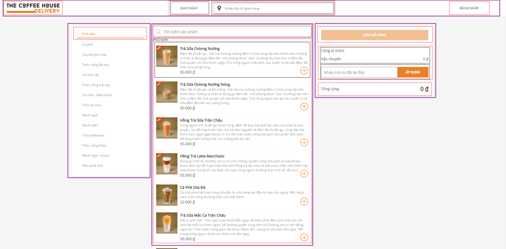

#
1. Chia giao diện thành các component

- header (màu tím)
    + header left (màu đỏ)
    + header center (màu đỏ)
        * call (màu xanh lá)
        * shipping address (màu xanh lá)
    + header right (màu đỏ)
- main
    + main list category (màu tím)
        * main items category (màu đỏ)
    + main product (màu tím)
        * main search product (màu đỏ)
        * main list product (màu đỏ)
            . main list product (màu xanh lá)
    + main cart (màu tím)
        * show cart (màu đỏ)
        * main cart mid (màu đỏ)
            . ship (màu xanh lá)
            . discount code (màu xanh lá)
        * total price (màu đỏ)
2. Xây dựng giao diện tĩnh
