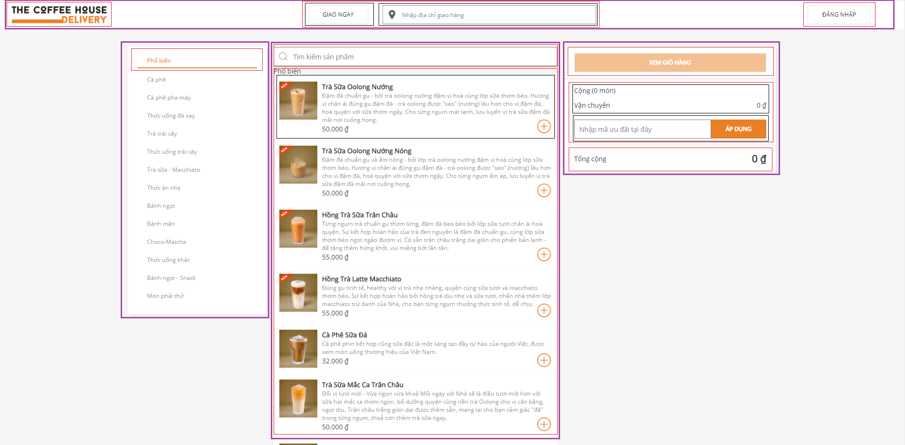

#
1. Chia giao diện thành các component

- header (màu tím)
    + header left (màu đỏ)
    + header center (màu đỏ)
        * call (màu xanh lá)
        * search shipping address (màu xanh lá)
    + header right (màu đỏ)
- main
    + main list category (màu tím)
        * main items category (màu đỏ)
    + main product (màu tím)
        * main search product (màu đỏ)
        * main list product (màu đỏ)
            * main list product (màu xanh lá)
    + main cart (màu tím)
        * show cart (màu đỏ)
        * main cart mid (màu đỏ)
            * ship (màu xanh lá)
            * discount code (màu xanh lá)
        * total price (màu đỏ)
2. Xây dựng giao diện tĩnh trong reactjs
3. Xác định các trạng thái hoàn chỉnh nhỏ nhất của giao diện người dùng
- Các thành phần dữ liệu trong my-app:
    + header center
        + call
        + search shipping address
    + header right (login)
    + main list category
        + main items category 
    + main product
        + main search product 
        + main list product 
    + main cart
4. Xác định danh sách sử dụng state
    - search shipping address
    - header right (login)
    - main list category
    - main search product 
    - main list product 
    - main cart