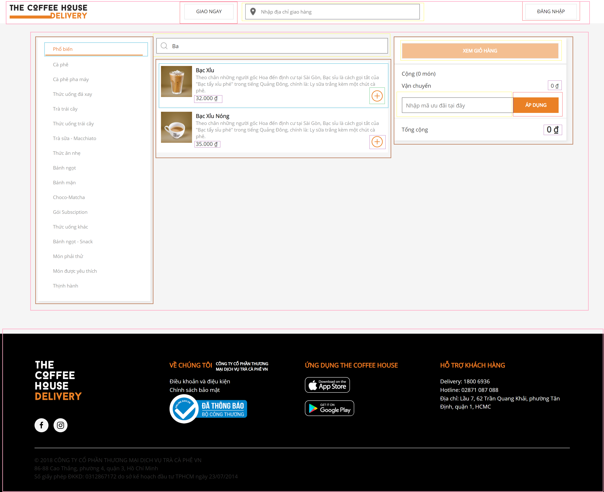

#
1. Chia giao diện thành các component

- Header(màu hồng)
- Main(màu hồng)
    + Category List(màu nâu)
        + Catrgory Item(Màu xanh biển)
    + Product List(màu nâu)
        + Product items(màu xanh biển)
    + Cart Compoent(màu nâu)
- Footer(màu hồng)
- Button(màu đỏ)
- Input Search (màu vàng)
- Button Add (màu xanh lá)
- Currency (màu tím)
2. Xây dựng giao diện tĩnh trong reactjs
3. Xác định các trạng thái hoàn chỉnh nhỏ nhất của giao diện người dùng
- Các thành phần dữ liệu trong my-app:
    + header center
        + call
        + search shipping address
    + header right (login)
    + main list category
        + main items category 
    + main product
        + main search product 
        + main list product 
    + main cart
4. Xác định danh sách sử dụng state
    - search shipping address
    - header right (login)
    - main list category
    - main search product 
    - main list product 
    - main cart